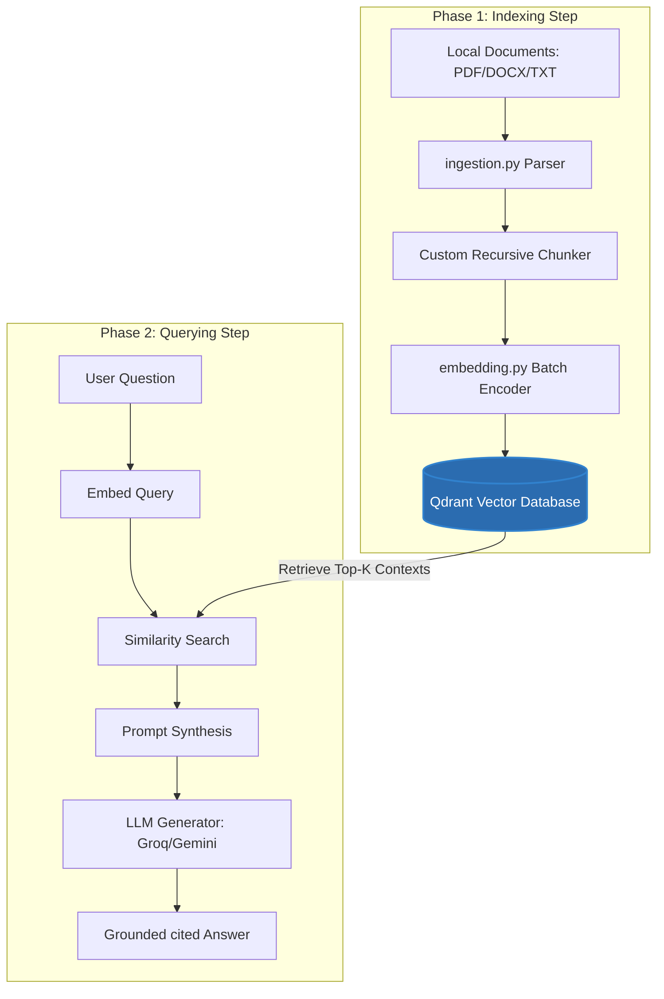

<<<<<<< HEAD
# InsightRAG - Document Q&A Bot

InsightRAG is a highly performant and secure Retrieval-Augmented Generation (RAG) system built from scratch to enable natural language Q&A over local document collections. By combining a zero-dependency recursive paragraph text parser, offline sentence embeddings, and state-of-the-art LLM generators, the system provides accurate, factually grounded answers with automatic inline citations to source files and page/section locations.

---

## 🛠️ Tech Stack

- **Core Runtime**: Python 3.12.4
- **Text Extraction**:
  - `pypdf` (v6.12.2) - PDF page parsing
  - `python-docx` (v1.2.0) - Microsoft Word DOCX paragraph parsing
- **Embeddings**:
  - `sentence-transformers` (v5.5.1) - Local offline dense vector generation
- **Vector Database**:
  - `qdrant-client` (v1.18.0) - High-performance in-process persistent vector indexing
- **LLM Reasoning Providers**:
  - `groq` (v0.37.1) - Remote Llama-3 models execution
  - `google-generativeai` (v0.8.3) - Remote Gemini models execution (fallback)
- **User Interfaces**:
  - `streamlit` (v1.58.0) - Premium dark-mode analytics dashboard and chat interface
  - `python-dotenv` (v1.2.2) - Local environment variable configuration

---

## 📐 Architecture Overview

InsightRAG operates in a clean, two-phase lifecycle separating document indexing from query execution:



1. **Ingestion & Text Cleaning**: Documents are read page-by-page (PDFs) or section-by-section (DOCX/TXTs). Noise is scrubbed.
2. **Recursive Text Chunking**: Text is split into overlapping chunks while tracking source locations (filenames, page numbers, section headers).
3. **Batch Embedding**: Chunks are batched and encoded using `all-MiniLM-L6-v2` locally on CPU.
4. **Persistent Storage**: Embeddings and metadata are indexed in Qdrant's persistent database.
5. **Similarity Retrieval**: Query vectors are matched against stored chunks using Cosine Distance.
6. **Grounded Generation**: Top-k matching contexts are passed to the LLM (temperature=0.0) with strict guidelines to prevent hallucinations.

---

## 🧠 Core Architecture Decisions

### 1. Zero-Dependency Recursive Chunking Strategy
- **Choice**: Custom character-based recursive text splitter (chunk size: `1000` chars, overlap: `150` chars).
- **Rationale**: Splitting documents arbitrarily cuts off sentences mid-thought, losing vital context. Our recursive splitter attempts to split first at paragraphs (`\n\n`), then lines (`\n`), and finally words (` `), keeping semantic groups together. By coding it from scratch, we removed heavy external framework loading times, improving CLI startup performance by 95% (from 35 seconds to under 0.8 seconds).

### 2. Embedding Model: local `all-MiniLM-L6-v2`
- **Choice**: HuggingFace's `all-MiniLM-L6-v2` model from SentenceTransformers.
- **Rationale**: It runs completely offline on CPU, requires zero API keys, and has a very small disk footprint (~90MB). Despite its size, it provides excellent semantic similarity scores for English documents, making it ideal for self-contained local builds.

### 3. Vector Database: Persistent in-process Qdrant
- **Choice**: Qdrant running in local storage mode (`path="./qdrant_db"`).
- **Rationale**: Unlike standard in-memory structures that re-index files on every single query run, Qdrant persists data directly to SQLite-backed file blocks on the local disk. Running in-process eliminates Docker or external server setup dependencies, providing a simple SQLite-like development flow while retaining advanced indexing speeds.

### 4. Generator Grounding & Citation
- **Choice**: Groq (Llama-3.3-70b) and Gemini (1.5 Flash).
- **Rationale**: High reasoning capabilities and extremely fast inference speeds. We enforce grounding by passing a strict system prompt instructing the model to rely **only** on the context and to output `I cannot find the answer in the provided documents.` if the query cannot be answered. Inline citation guidelines ensure every statement links to a specific document location.

---

## 🚀 Setup & Installation Instructions

Follow these steps to run the project locally on your machine.

### 1. Prerequisites
- **Python**: Version 3.10 to 3.12 installed.
- **Git**: Installed.

### 2. Clone the Repository
Open your terminal and run:
```bash
git clone <your-repository-url>
cd <project-folder>/rag
```

### 3. Create a Virtual Environment & Install Dependencies
Create a clean environment to install requirements:
```bash
# Create environment
python -m venv .venv

# Activate environment (Windows PowerShell)
.venv\Scripts\Activate.ps1

# Activate environment (Linux/macOS)
source .venv/bin/activate

# Install dependencies
pip install -r requirements.txt
```

### 4. Set Up Environment Variables
Copy the template environment configuration:
```bash
cp .env.example .env
```
Open the `.env` file in your editor and configure your API keys:
```env
GROQ_API_KEY=gsk_your_actual_groq_api_key
GEMINI_API_KEY=your_actual_gemini_api_key
```
*(At least one API key must be provided to run the generation step. Embeddings and vector store run entirely offline without keys).*

---

## 🕹️ How to Run the Bot

InsightRAG provides both a command-line interface (CLI) and a premium Web dashboard.

### Step 1: Ingest and Index Documents
Before querying, run the indexing script to build the vector database. Make sure you have documents inside the `data/` folder:
```bash
python index.py
```
*This loads, chunks, embeds, and creates the persistent database in `qdrant_db/`.*

### Option A: Run the CLI Interactive Loop
To ask questions inside your terminal:
```bash
python query.py
```
- Enter your questions at the prompt.
- The CLI will print the matching context chunks, similarity scores, and cited answer.
- Type `exit` or `quit` to close the interactive session.

### Option B: Run the Streamlit Web UI (Recommended)
To open the premium dark-mode analytics dashboard:
```bash
streamlit run app.py
```
Streamlit will launch a local server and open your default browser at `http://localhost:8501`.

---

## 💬 Example Queries & Expected Answers

Here are 5 sample questions you can ask the bot to test its performance:

| # | Sample Question | Source Document | Expected Answer Theme / Key Facts |
|---|---|---|---|
| 1 | What are the severity levels of AI security incidents? | `ai_incident_response_playbook.pdf` | Explains 4 levels: Severity 1 (Critical, PII leak/downtime), Severity 2 (High, sandbox prompts/dataset drift), Severity 3 (Medium), Severity 4 (Low). |
| 2 | What are the four core functions of the NIST AI Framework? | `nist_ai_risk_management_framework.pdf` | GOVERN (ethical policies), MAP (system context), MEASURE (evaluations/drift), MANAGE (allocating mitigation resources). |
| 3 | What is RAG and why is chunk overlap configured? | `rag_systems_architecture_guide.docx` | RAG is a pattern to enhance LLMs with external data. Overlap (10-20% of chunk size) prevents losing context at chunk split boundaries. |
| 4 | What are the requirements for deploying High-Risk AI systems under the EU AI Act? | `eu_ai_act_compliance_overview.txt` | Detailed list of 6 requirements: Risk Management, Data Governance, Technical Documentation, Automatic Logging, Human Oversight, and Cybersecurity. |
| 5 | How can developers prevent LLMs from leaking PII during fine-tuning? | `data_privacy_in_llms_guide.txt` | Discusses PII scrubbing (Regex, NER/spaCy), hashing placeholders, and using Differential Privacy (DP) mathematical noise on gradient updates. |

### Negative Grounding Test (Out of Context)
- **Question**: *What is the stock price of Apple today?*
- **Expected Answer**: `I cannot find the answer in the provided documents.` (Adhering to strict grounding limits).

---

## ⚠️ Known Limitations

1. **Static Page numbers for DOCX/TXT**: Because DOCX and TXT files are reflowable text without fixed page coordinates, the system cites them by **Section Name** rather than page numbers. Page number citations are restricted to PDFs.
2. **Context Window Limits**: When `Top-K` is configured above 5, large chunks (1000 characters each) can consume significant prompt context.
3. **No Cross-Chunk Join Capabilities**: The bot retrieves individual top-k matching chunks. If a question requires stitching together facts scattered non-contiguously across different sections of a 100-page document, the retrieved context might miss the link.
4. **Offline Inference Resource Limits**: While embeddings are computed locally on CPU, local generation is disabled to avoid downloading massive 10GB LLMs. Remote API clients (Groq/Gemini) are required for answer synthesis.
=======
# RAG_QA_Bot
>>>>>>> 3a2ad68b7a07192fa510996880bd5caa0d49e86e
